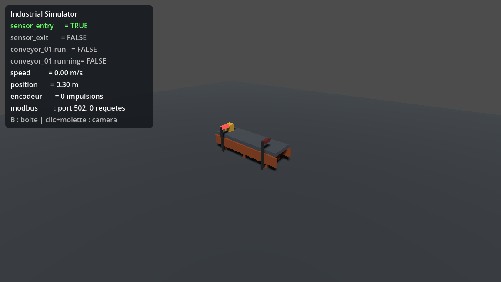

# Industrial Simulator

Plateforme open source de **simulation d'automatisation industrielle** : une usine virtuelle 3D est contrôlée par un **véritable automate programmable** (OpenPLC, SoftPLC, automate physique ou tout client Modbus TCP) — la logique d'automatisme vit dans le PLC, jamais dans le simulateur.

## Principe

```
Godot 4 (usine virtuelle 3D)
        |
Simulation Engine (cycle déterministe)
        |
Industrial Model (machines, capteurs, actionneurs)
        |
I/O Abstraction Layer (DI / DO / AI / AO / compteurs / encodeurs)
        |
Communication Layer (Modbus TCP - Phase 2)
        |
OpenPLC / PLC physique / SoftPLC / SCADA
```

Règles de séparation fondamentales :

* le moteur 3D ne connaît pas OpenPLC ;
* OpenPLC ne connaît pas Godot ;
* les deux échangent uniquement via l'abstraction industrielle (adresses `%IX` / `%QX` / `%IW` / `%QW`).

## Statut

**Premier milestone ATTEINT (Phases 0 → 5)** : modèle I/O complet, moteur de simulation déterministe, usine déclarative JSON, serveur Modbus TCP intégré, **cycle complet validé avec un vrai OpenPLC** (détection à l'entrée → marche → arrêt au capteur de sortie → évacuation, en boucle), et **scène 3D Godot** avec HUD et caméra orbitale.



Voir [ROADMAP.md](ROADMAP.md) — prochaines étapes : éditeur de scènes, machines supplémentaires, OPC UA…

## Prérequis

* [Godot 4.7.2](https://godotengine.org/download) (édition standard, pas mono).
* Optionnel : binaire console dans `tools/godot/` (non versionné) ou variable d'environnement `GODOT_BIN` pointant vers l'exécutable Godot. Les scripts de test utilisent l'un ou l'autre.

## Lancer les tests (headless, sans ouvrir l'éditeur)

Windows :

```bat
scripts\run_tests.bat
```

Linux / Git Bash :

```bash
scripts/run_tests.sh
```

Ou directement :

```bash
godot --headless --path simulator --script res://tests/run_tests.gd
```

Code de sortie `0` = tous les tests passent.

## Lancer l'usine avec Modbus TCP

**Avec la 3D** — ouvrir `simulator/project.godot` dans Godot 4.7.2 puis F5 : la scène démarre avec le serveur Modbus (port 502 par défaut). `B` pose une boîte, clic gauche + molette pour la caméra, le HUD affiche l'état temps réel. Ou en headless :

```bat
scripts\run_simulator.bat --port=1502 --box=8
```

N'importe quel client Modbus peut alors lire les capteurs (`%IX0.0`, `%IX0.1`) et commander le convoyeur (`%QX0.0`) — détails et exemples Python dans [docs/protocols/modbus_tcp.md](docs/protocols/modbus_tcp.md). Options : `--port=1502`, `--box=8` (boîte toutes les 8 s), `--no-spawn`.

## Brancher OpenPLC

Guide complet, testé avec un vrai OpenPLC v3 : [plc/openplc/README.md](plc/openplc/README.md) — deux programmes fournis : [`conveyor.st`](plc/openplc/conveyor.st) (logique minimale) et [`conveyor_cycle.st`](plc/openplc/conveyor_cycle.st) (cycle continu avec temporisations).

## Ouvrir le simulateur

Ouvrir `simulator/project.godot` dans Godot 4.7.2 puis F5 : la scène 3D du prototype démarre (convoyeur, boîte, capteurs, HUD) avec le serveur Modbus actif. Capture automatique sans fenêtre : `godot --path simulator -- --capture` (écrit `simulator/capture_3d.png`).

## Structure du dépôt

```
industrial-simulator/
├── ARCHITECTURE.md          Architecture cible et décisions
├── ROADMAP.md               Phases 0 → 12 et critères du premier milestone
├── CONTRIBUTING.md          Comment contribuer
├── docs/
│   ├── architecture/        Registre des décisions (ADR)
│   ├── simulation/          Documentation du cycle de simulation
│   ├── protocols/           (Phase 2) Documentation Modbus TCP
│   └── plc/                 (Phase 3) Documentation OpenPLC
├── simulator/               Projet Godot 4
│   ├── io/                  Modèle I/O abstrait (indépendant du rendu)
│   ├── simulation/          Simulation Engine + FactoryBuilder (usine en JSON)
│   ├── machines/            Machines virtuelles (convoyeur, puis vérins…)
│   ├── communication/       Couche communication (PlcLink, puis Modbus TCP)
│   ├── scenes/              Scènes Godot
│   ├── ui/                  (Phase 5) HUD et interface
│   ├── config/              Définition d'usine et mapping PLC (JSON)
│   └── tests/               Tests unitaires headless
├── backend/                 (Différé - voir ADR-003)
├── plc/                     (Phase 3) Programmes OpenPLC et mappings
├── examples/                (Phase 4) Exemples complets
├── docker/                  (Phase 3+) Conteneurs (OpenPLC…)
└── scripts/                 Scripts de lancement des tests
```

## Documentation

* [ARCHITECTURE.md](ARCHITECTURE.md) — architecture cible, contrats d'interfaces, modèle I/O
* [docs/simulation/simulation_cycle.md](docs/simulation/simulation_cycle.md) — le cycle de simulation en 6 temps
* [docs/architecture/decisions.md](docs/architecture/decisions.md) — registre des décisions architecturales (ADR)
* [ROADMAP.md](ROADMAP.md) — feuille de route détaillée

## Contribuer

Voir [CONTRIBUTING.md](CONTRIBUTING.md). Licence : MIT (voir [LICENSE](LICENSE)).
